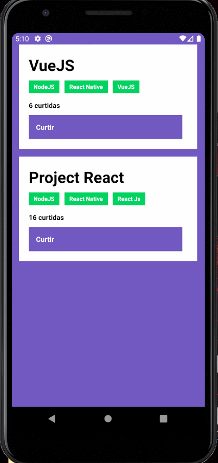

<h3 align="center">
  Challenge 04: React Native concepts
</h3>

“Success is not the result of a game, but the destination of a journey”!</blockquote>

  

  

  

  

  <a href="#rocket-sobre-o-desafio">About the challenge</a>&nbsp;&nbsp;&nbsp;|&nbsp;&nbsp;&nbsp;
  <a href="#memo-licença">License</a>

  

## :rocket: About the challenge

In this challenge, you must create an application to train what you have learned so far in React Native!

Now you must continue to develop the application that will store your portfolio repositories, which you have already developed the backend using Node.js, and in the last challenge in ReactJS.

### Application template

To help you with this challenge, we have created a template for you that you should use as a github template.

The template is available at the following url: **[Access Template](https://github.com/Rocketseat/gostack-template-conceitos-react-native)**

Now navigate to the created folder and open it in Visual Studio Code, run the command `yarn` in your terminal to install all dependencies and you are ready to start.

**Attention...**: If you are emulating on iOS, in your project folder, navigate to the ios folder by running the `cd ios` command and then run` pod install` to install all the dependencies for iOS.

### Application features

Now that you have the template cloned, and ready to continue, you must open the file **src/App.js**, and complete where there is no code with the code to achieve the objectives of each feature.

- **`List your API repositories`**: You should be able to create a list of all the repositories that are registered in your API with the fields ** title **, ** techs ** and number of likes following the pattern `$ {repository.likes} likes`, just changing the number to be dynamic.

- **`Like a listed API repository`**: Deve ser capaz de curtir um item na sua API através de um botão com o texto **Curtir** e deve atualizar o número de likes na listagem no mobile.

### Testing specification

In each test, you have a brief description of what your application must do in order for the test to pass.

For this challenge we have the following tests:

- **`should add a like to the like counter of the repository`**: In order for this test to pass, your application must allow, by clicking on the 'Like' button, a like is added to the listed repository, and that this update can be viewed on the screen.

## :memo: License

This project is under the MIT license. See the archive[LICENSE](LICENSE.md)

---

Feito com 💜 by Rocketseat :wave: [Entre na nossa comunidade!](https://discordapp.com/invite/gCRAFhc)
